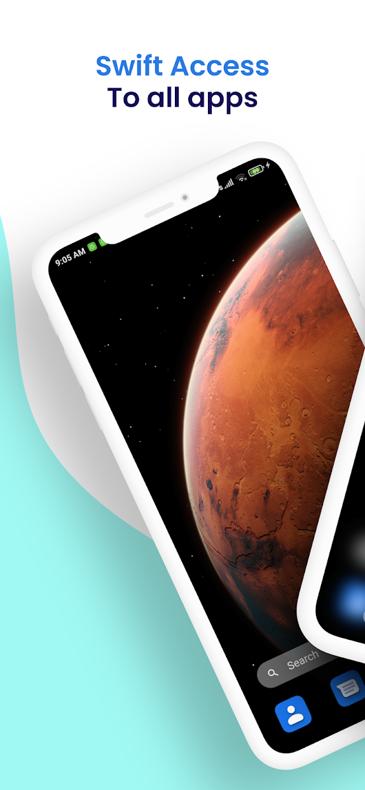
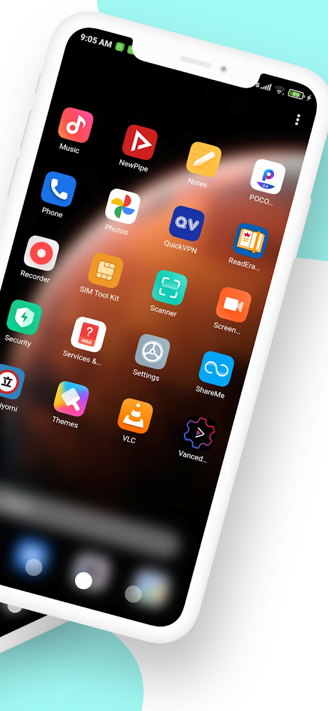
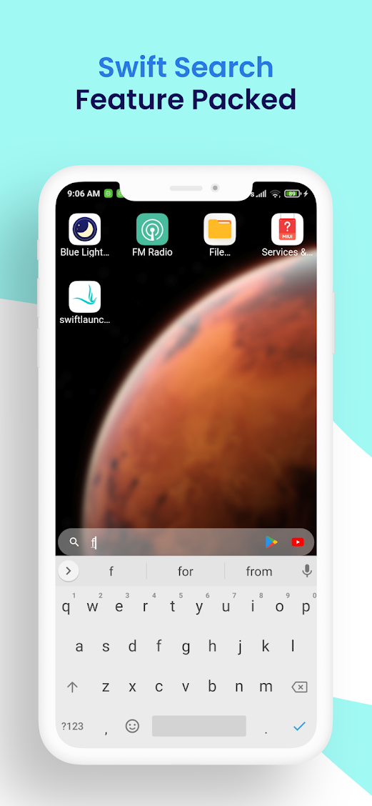
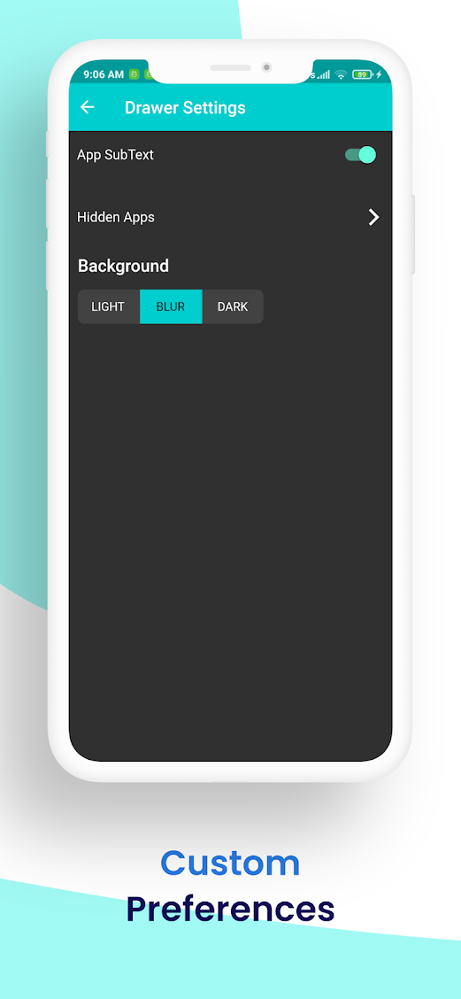

# swiftlauncher

A feature rich Android launcher completely made in flutter.

## Playstore link

[https://play.google.com/store/apps/details?id=com.eyriscrafts.swiftlauncher](https://play.google.com/store/apps/details?id=com.eyriscrafts.swiftlauncher)

## Current Features

1. IconPack Supported
2. Drawer Rearrangement supported
3. Swift Search, that can search on google / youtube / youtube vanced / playstore / contacts (if given permission)
4. basic themes 

 
 

## Contributions are welcome :)

